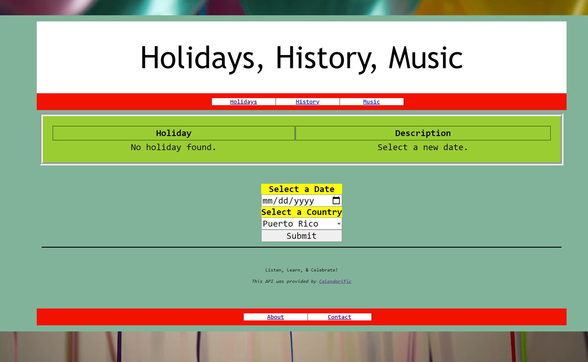

# About Capstone

This is the very first SAP I've created from scratch. It was made with html, css, and Javascript.

​The website is called "Holidays, History, Music. It was made to help people learn more about different cultures. Specifically, users can learn about holidays of Puerto Rico, Sweden, and Japan.

Here is a link to where you can use the website:
https://holidayhistorymusic.netlify.app/
Select the date, January 1, to get your first holiday: New Year's Day.

# How the site works
Users come to the site and can "Select a Date" and "Select Country" to find what holidays occurs on that date in the specified country.

If there is no holiday happening on your selected date, "No Holiday Found" will appear under the Holiday and description and you'll be asked to select another date.

If a holiday IS happening on the selected date, the holiday's name will appear, along with a short description. Then, you can select the "History" or "Music" tabs to see more information about the holiday.

Under the History tab, you'll see 3 resources about your holiday: 1) A wikipedia article, 2) Poetry, and 3) a Book list about the holiday.

Under the Music tab, you'll see (and can listen to) music about your holiday.

# To Coders and Future Collaborators

The formulas to utilize the API are found on Calendarific's site: https://calendarific.com/api-documentation

## PROBLEMS

 1. The API used, Calenderific, has a limit on API calls per month. So the website may not work at times until the next 30 day cycle.  To improve this in the future, I may add a statement to limit the amount of calls per month. And also make the API not call if there is no new date selected.

2. Users have to search to find a holiday. There is no way to tell if a selected date has a holiday until you select a date and then hit "submit." From the user standpoint, this can be frustrating. The website needs to be able to show which dates have holidays so that users can know what dates to select. In th future, this layout should be added.

3. The results on the History and Music tabs vary. The site simply takes the Holiday name and plugs it in as the search result for the resources. For example, if you select "New Year's Day," those are the exact words that the resources will search for on their databases. This means you can end up with unrelated material that just has the words "New Year's Day" in it.

In the future, there needs to be a better way for searches to get more accurate information.

# Final Notes:
This is my very first project and I'm am proud of it. I can't wait to see how better it will be once I learn more. Please feel free to message me with any questions or comments!
